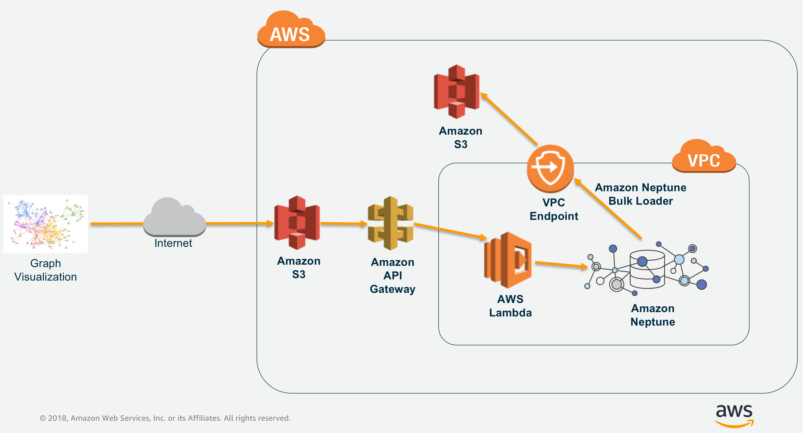

# Visualize data in Amazon Neptune using VIS.js library

This GitHub lab will take you through hands-on excercise of visualizing graph data in Amazon Neptune using VIS.js library.
Amazon Neptune is a fast, reliable, fully-managed graph database service available from AWS.
With Amazon Neptune you can use open and popular graph query languages such as Apache TinkerPop Gremlin for property graph databases or SPARQL for W3C RDF model graph databases.

## Primer
Currently, Amazon Neptune does not provide visualization service from the AWS console.
Customers can leverage our partner solutions mentioned below to perform visualization of data in Amazon Neptune.
Some of our partners in this area are - 
1. Tom Sawyer Perspectives by TomSawyer Softwares
2. Keylines by Cambridge Intelligence
3. Metaphactory by Metaphacts etc.  
Customers can leverage above commercial solutions to visualize data in Amazon Neptune.  
There are also open source libraries and solutions available. Few of them are -
1. GraphExp open source visualization tool by 
2. D3.js javascript library by D3JS.org 
3. VIS.js open source library by VISJS.org etc.
Customers can use these visualization libraries to build their own applications and products on top of Amazon Neptune.

In the rest of the lab, we will focus on visualizing  data in Amazon Neptune using [VIS.js](http://visjs.org).
VIS.js is a Javascript library used for visualizing graph data. It has various components such as DataSet, Timeline, Graph2D, Graph3D, Network etc. for displaying data in various ways.

## PREREQUISITES:

1. Amazon Neptune Cluster
2. Access to AWS IAM for
* creating AWS Lambda functions
* creating IAM roles for Amazon Neptune cluster to access S3 and, for API Gateway to access AWS Lambda functions
* APIs in Amazon API Gateway
* Amazon S3 buckets 
* creating and attaching VPC Endpoints to the VPC

## Architecture

Below is the architecture that we will be using to visualize data in Amazon Neptune using VIS.js
Since Amazon Neptune instance can't be accessed outside the VPC, we are using AWS Lambda function in VPC. This AWS Lambda function is accessed through the proxy created and exposed to internet using Amazon API Gateway.
Once the proxy is exposed, we can access the APIs from Javascript code being executed from Amazon S3 (statis website).

## Steps
1. [Provision Amazon Neptune Cluster and configure it for access to S3](#1-Provision Amazon Neptune Cluster and configure it for access to S3)
2. Load data into Amazon Neptune
3. Create and Configure AWS Lambda Function
4. Create and Configure Amazon API Gateway - Proxy API
5. Configure Amazon S3 bucket for hosting a static website

1. Provision Amazon Neptune Cluster and configure it for access to S3

